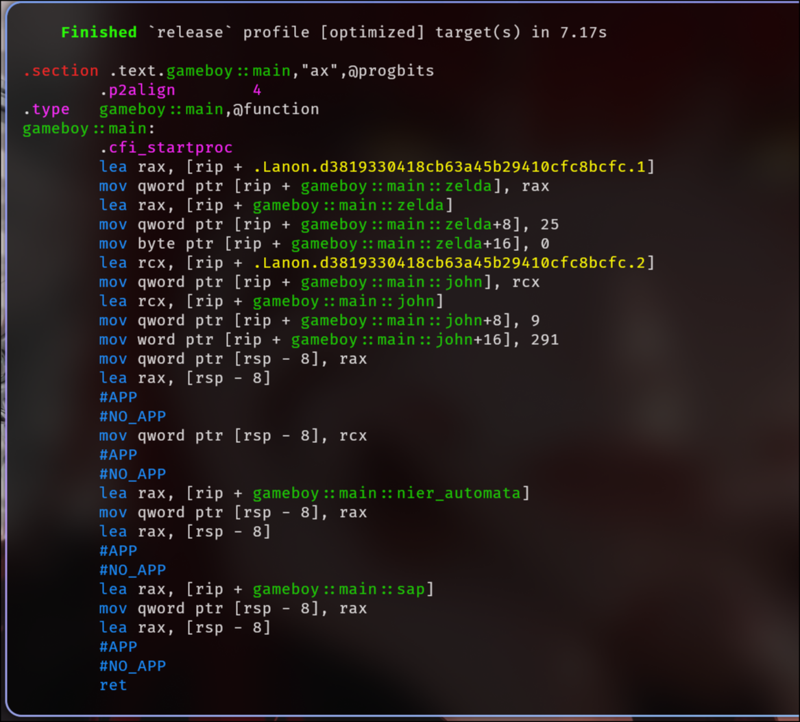

# kyaaa 🚀 (Beta)

An ultra-efficient, **zero-cost, `no_std`-compatible Heterogeneous List (HList)** implementation for Rust using declarative macros. It bridges the gap between high-level ergonomic data modeling and bare-metal assembly performance.

---

## ✨ Key Features

| Feature | Description |
|---------|-------------|
| **Zero Allocation** | Backed entirely by static memory blocks and raw pointers (`*const ()`). No heap allocations (`Box`, `Vec`) — optimal for embedded systems, game engines, drivers, and kernels. |
| **Dual-Access Ergonomics** | Semantic named access (`hlist.zelda()`) combined with dynamic index-based retrieval via an automatically derived `u8` enum (`hlist.get(0)`). |
| **Surgical Mutability** | Fields prefixed with `mut` are selectively wrapped in an `UnsafeCell` with manual `Sync` guarantees, avoiding blanket mutability or heavy synchronization primitives (`Mutex`, `RwLock`). |
| **Zero-Cost Abstraction** | Optimized aggressively by LLVM into direct static memory offsets with **zero runtime overhead** and zero function call instructions (`call`). |

---

## 📦 Installation

```bash
cargo add kyaaa
```

---

## 🎮 Zero-Cost Assembly Example (`examples/gameboy.rs`)

This is the exact code used to verify the zero-cost assembly output, featuring mixed structs, named mutability, and optimization barriers:

```rust

use kyaaa::book;

#[repr(transparent)]
pub struct Name(&'static str);

#[repr(transparent)]
pub struct Title(&'static str);

pub struct Game {
    title: Title,
    best_seller: bool,
}

pub struct Boy {
    name: Name,
    dev: bool,
    age: u8,
}

fn main() {
    let hlist = book!(
        nier_automata => Game { title: Title("Nier Automata"), best_seller: true },
        mut zelda => Game { title: Title("Zelda"), best_seller: true },
        sap => Boy { name: Name("SAP2B"), age: 69, dev: true },
        mut john => Boy { name: Name("John Doe"), age: 15, dev: false }
    );

    unsafe {
        hlist.zelda().title = Title("Zelda: Breath of the Wild");
        hlist.zelda().best_seller = false;

        hlist.john().name = Name("John Wick");
        hlist.john().dev = true;
        hlist.john().age = 35;

        black_box(hlist.zelda());
        black_box(hlist.john());
    }

    black_box(hlist.nier_automata());
    black_box(hlist.sap());
}

#[inline(always)]
fn black_box<T>(dummy: T) -> T {
    core::hint::black_box(dummy)
}
```
---

## 🔬 Assembly Proof (Zero-Cost Verified)

Inspecting the optimized release assembly via `cargo asm --example gameboy --release gameboy::main`:



### Why This Architecture is a Masterpiece:
1. **Zero Function Calls:** The `call` instruction is completely absent. Accessor methods are aggressively inlined by LLVM.
2. **Direct Static Memory Offsets:** String pointer updates (`+8`), boolean/integer modifications (`+16`), and property writes target static memory offsets directly relative to the instruction pointer (`rip`).
3. **Pure Machine Efficiency:** Zero allocators, zero locks, zero hidden vtables—just raw, bare-metal pointer manipulation operating at maximum processor velocity.

---

## 🔍 Advanced Features: Dynamic Index Retrieval (`get`)

If you need to fetch items dynamically by index or write unit tests, `kyaaa` automatically maps every element to an internal `u8` index via `get(u8)`:

```rust
use kyaaa::{SeqLock, book};

#[derive(Debug, PartialEq, Copy, Clone)]
struct User {
    name: &'static str,
    password: &'static str,
}

#[derive(Debug, PartialEq, Copy, Clone)]
struct Admin {
    name: &'static str,
    password: &'static str,
    dev: bool,
}

#[test]
fn test_hlist_book() {
    let hlist = book!(
        bob => User { name: "Bob", password: "12345" },
        mut sap => Admin { name: "SAP", password: "UwU", dev: true },
        readfull stats => Admin { name: "Stats", password: "LockFreePass", dev: false },
        admin => Admin { name: "Admin", password: "OwO", dev: true },
        mut alice => User { name: "Alice", password: "67890" },
        readfull lock_user => User { name: "LockBob", password: "abc" }
    );

    assert_eq!(hlist.bob().name, "Bob");
    assert_eq!(hlist.bob().password, "12345");
    assert_eq!(hlist.admin().name, "Admin");
    assert!(hlist.admin().dev);

    unsafe {
        hlist.alice().password = "New_Alice_Password";
        hlist.sap().password = "New_Sap_Password";
        hlist.sap().dev = false;

        assert_eq!(hlist.alice().password, "New_Alice_Password");
        assert_eq!(hlist.sap().password, "New_Sap_Password");
        assert!(!hlist.sap().dev);
    }

    assert_eq!(
        hlist.stats().read(),
        Admin {
            name: "Stats",
            password: "LockFreePass",
            dev: false
        }
    );

    hlist.stats().write(Admin {
        name: "Stats_Updated",
        password: "SecurePass123",
        dev: true,
    });

    assert_eq!(
        hlist.stats().read(),
        Admin {
            name: "Stats_Updated",
            password: "SecurePass123",
            dev: true
        }
    );

    hlist.lock_user().write(User {
        name: "LockBob_Updated",
        password: "xyz",
    });

    assert_eq!(hlist.lock_user().read().password, "xyz");

    let bob_retrieved: &User = hlist.get(0);
    assert_eq!(bob_retrieved.name, "Bob");
    assert_eq!(bob_retrieved.password, "12345");

    let sap_retrieved: &Admin = hlist.get(1);
    assert_eq!(sap_retrieved.name, "SAP");
    assert_eq!(sap_retrieved.password, "New_Sap_Password");
    assert!(!sap_retrieved.dev);

    let stats_retrieved: &SeqLock<Admin> = hlist.get(2);
    assert_eq!(stats_retrieved.read().name, "Stats_Updated");

    let admin_retrieved: &Admin = hlist.get(3);
    assert_eq!(admin_retrieved.name, "Admin");
    assert!(admin_retrieved.dev);

    let alice_retrieved: &User = hlist.get(4);
    assert_eq!(alice_retrieved.name, "Alice");
    assert_eq!(alice_retrieved.password, "New_Alice_Password");

    let lock_user_retrieved: &SeqLock<User> = hlist.get(5);
    assert_eq!(lock_user_retrieved.read().password, "xyz");
}
```

---

## ⚖️ License

Licensed under the **GNU Affero General Public License v3.0 (AGPLv3)**.

