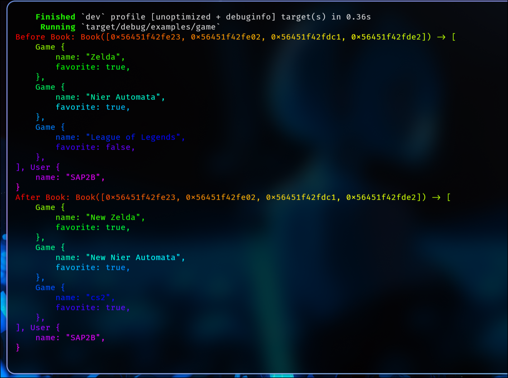
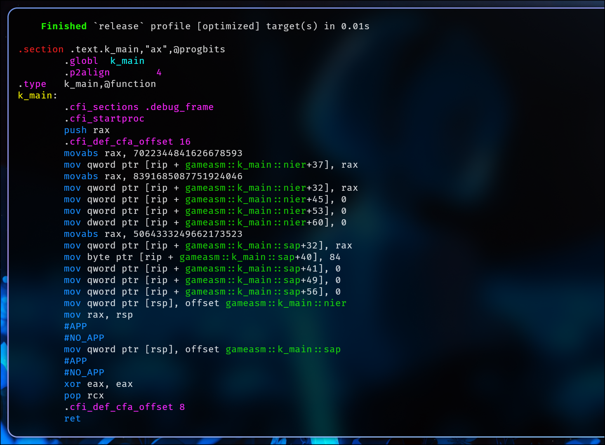

# Book macro

## Quick Start
```rust
{{#include ../../examples/quick.rs}}
```

## Examples
### game.rs
```rust
{{#include ../../examples/game.rs}}
```
#### cargo run
 

### gameasm.rs

```rust
{{#include ../../examples/gameasm.rs}}
```
#### assembly proof
```bash
cargo asm --example gameasm --release gameasm::main
```
#### output


### tests
```rs
{{#include ../../tests/book.rs}}
```
